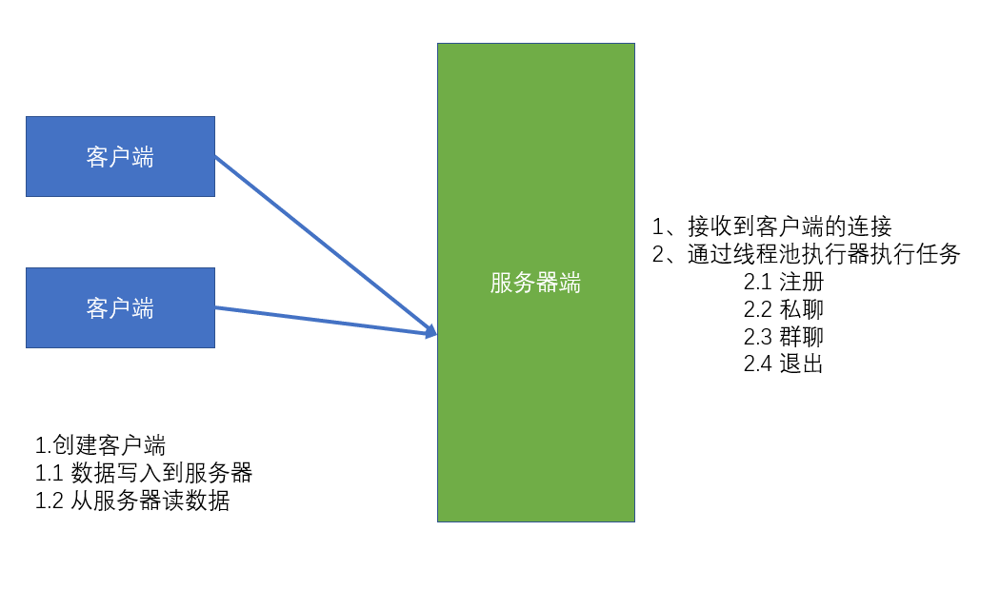

## 项目名称

畅聊

## 项目描述

支持单聊、群聊的网络聊天室

## 使用技术

+ JavaSE基础
+ Socket编程
+ I/0流
+ Maven管理工具

## 项目功能

1.服务端
+ 管理注册的用户
+ 私聊对象发送数据
+ 在线用户发数据
+ 退出时用户删除掉
+ 循环监听客户连接

2.客户端
+ 交互式输出数据
+ 输出服务器响应的数据

## 项目实现

服务端：采用线程池调度执行服务器与客户端业务处理逻辑 
客户端：采用读写线程,分别处理与服务器数据接收与发送

## 项目总结

+ 熟悉了项目的开发流程
+ 掌握了Java网络编程的常用函数以及操作步骤
+ 提升了对多线程的认识与使用 
+ 加深对Maven工具的理解和掌握
